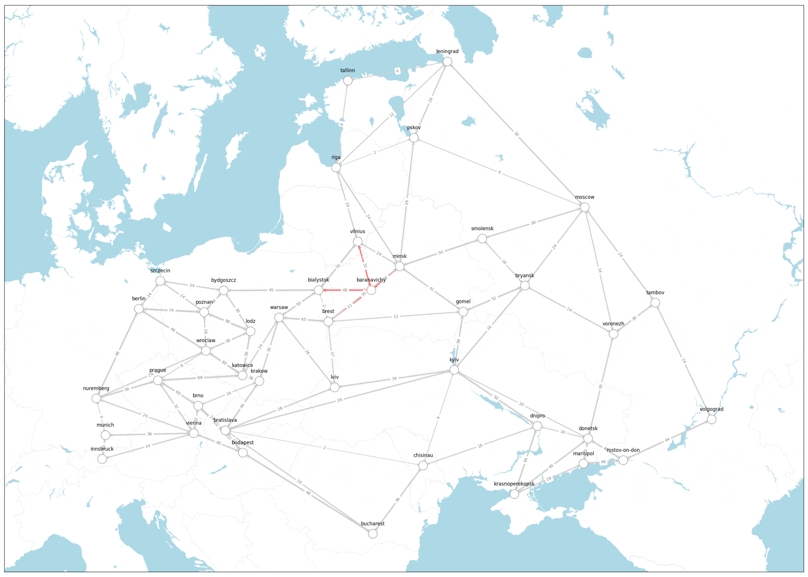

# How the CIA Used Network Science for the War Effort

## Introduction
The article was initially published on medium this directory contains the code behind used for the article: 

### Sources
- The data used for this projcet can be found in the `data` directory.
- The referenced articles can be found in the `sources` directory.
- The visualizations can be found in the `output` directory.
